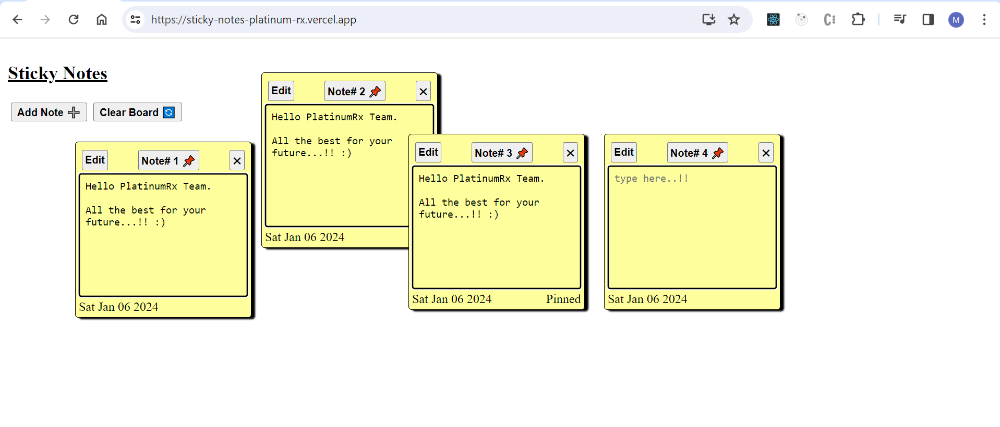

### Sticky Notes App - PlatinumRx

This project was bootstrapped with [Create React App](https://github.com/facebook/create-react-app).
The project was made as an assignment task for PlatinumRx.

All the asked features in the assignment document are implemented. Creative liberty has been taken to style the project. A few additional features have also been implemented.

### Project Link

- https://sticky-notes-platinum-rx.vercel.app/

### Below Features are implemented

- Users can add new notes by clicking on the "+" button.
- Users can delete notes by clicking on the "X" button.
- Users will be able to directly edit notes by clicking on them.
- Users will be able to edit the note by clicking on the edit button. The cursor will be pointed to the beginning of the note.
- All the notes are draggable to any position on the board.
- The User can pin the note by clicking on the "📌" button. It will make the note un-draggable, and it will prevent other notes from overlapping with them.
- Each Note has a specific note# and the date it was created.
- Local Storage is used to persist the data on reload.
- The Clear Board button has been made available to clear the board and reload the page.
- No external packages/libraries were used to implement the project.

### Steps to Launch the Project Locally

- Download the zip file from GitHub.
- Extract the zip file and open in Visual Studio Code.
- In Visual Studio Code, inside the root directory, open the terminal and run the command "npm i" to install the required dependencies.
- Run npm start
- Open "localhost:3000" in Chrome to access the project.

Made with ❤ by Md. Shadab Hussain
